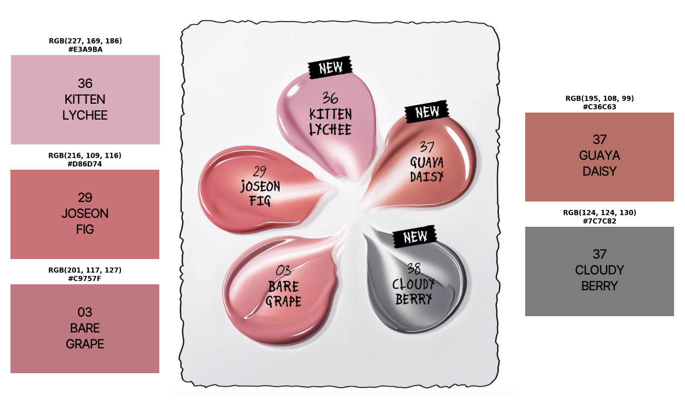
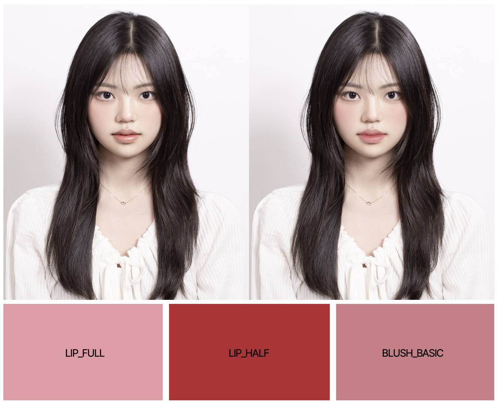
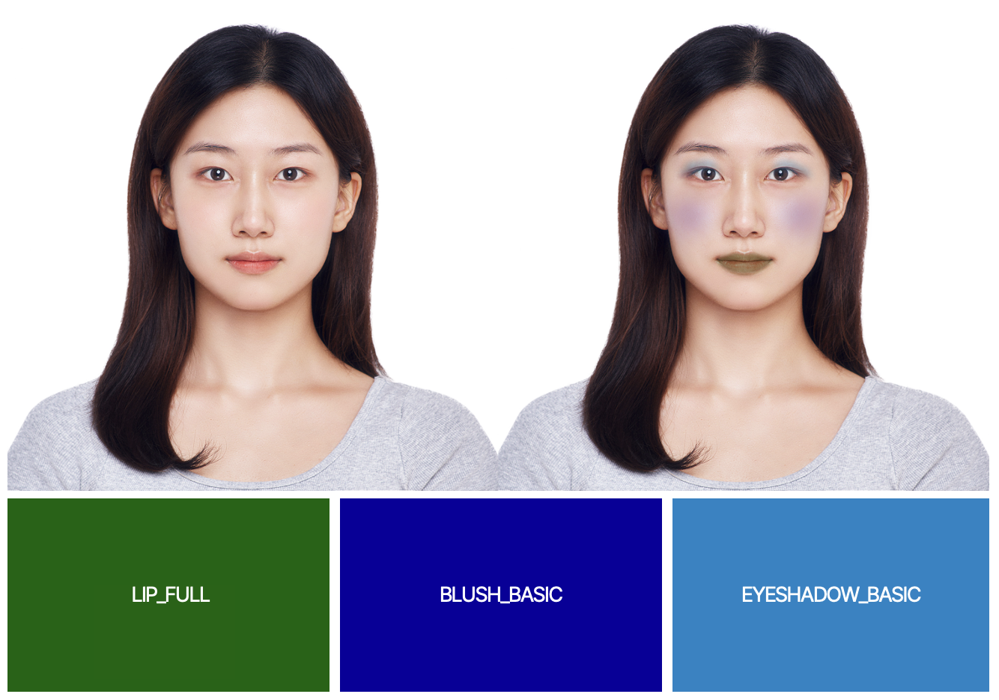

<div align="center">
<h1> Magic Makeup </h1>
    
 [**Minsuh Joo**](https://github.com/juminsuh) · [**Chehun Han**](https://github.com/chehun16) · [**Hyomin Kim**](https://github.com/Kim-Hyomin) · [**Jiyoon Jeon**](https://github.com/JuneJe0n)

</div>


<h2>Introduction</h2>

This project proposes **Magic Makeup**, a virtual makeup system that extracts colors from cosmetic product images and automatically applies them to a user’s facial image. <br>
When a user uploads an image of a desired cosmetic product (e.g., lipstick, blush, or eyeshadow), the system allows the user to specify a region of interest (ROI) through an interactive canvas and automatically extracts representative colors from the selected region.
The extracted color and texture are then naturally applied to the user’s face image using MediaPipe’s facial landmark detection. <br>
This system addresses the color mismatch problem commonly encountered in online cosmetic purchases and provides users with a personalized virtual makeup experience.

<br>

<h2>Getting Started</h2>

- You can try out our demo by running:
    ```
    MagicMakeup_demo.ipynb
    ```
- Refer to our documentation for detailed instructions : [link to documentation](https://octagonal-seal-4cc.notion.site/Magic-Makeup-2c7de10eb46a804398ece7f26a552ff3)
- Read our project report for more details : [link to project report](https://drive.google.com/file/d/1T82ZGh8JtCP74HB_O5L_im5G1l6MjxY8/view?usp=sharing)
<br>

<h2>Pipeline</h2>
<br>

<h2>Results</h2>
<h3>Color Extraction</h3>
<br><br>

<h3>Makeup Application</h3>
<br>
The makeup application pipeline works well even with extreme colors:
<br><br>
